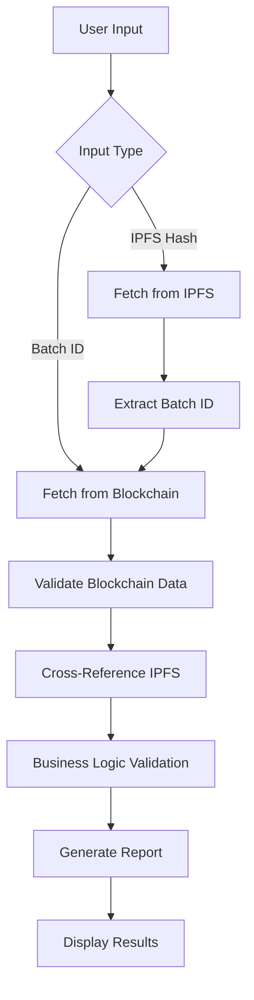
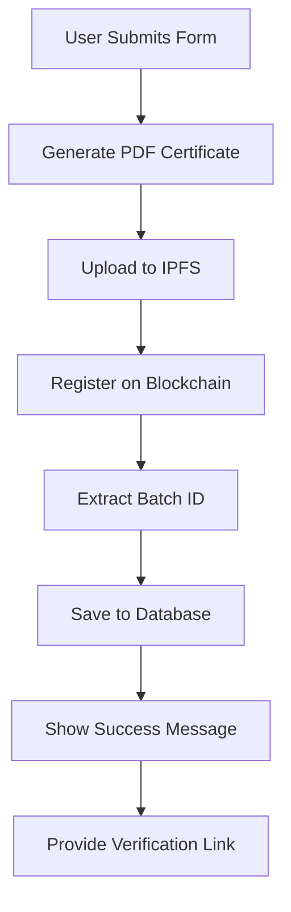

# Certificate Verification & Database Integration Features

## 🎯 Overview

This document outlines the comprehensive certificate verification system and database integration features implemented for the AgriTrace application.

## ✅ Features Implemented

### 1. Certificate Verification System

#### **Multi-Level Verification**
- **Blockchain Verification**: Validates batch data against immutable blockchain records
- **IPFS Verification**: Checks certificate authenticity via decentralized storage
- **Data Consistency**: Ensures data integrity across all systems
- **Business Logic Validation**: Validates dates, prices, and other business rules

#### **Verification Methods**
- **Batch ID Verification**: Verify certificates using blockchain batch ID
- **IPFS Hash Verification**: Verify certificates using IPFS hash directly
- **URL Parameter Support**: Auto-verify when accessed via direct links

#### **Comprehensive Validation**
- Required field validation
- Date format and logic validation
- Price validation (must be > 0)
- Ownership transfer detection
- Freshness duration checks
- IPFS hash matching

### 2. Enhanced Database Integration

#### **Improved Batch Registration Flow**
- **Fixed Batch ID Extraction**: Properly extracts batch ID from blockchain events
- **Fallback Mechanism**: Uses contract's nextBatchId if event parsing fails
- **Complete Database Sync**: Ensures all batch data is saved to Supabase
- **Error Handling**: Graceful handling of database save failures

#### **Database Schema Support**
- `blockchain_id`: Links to blockchain batch ID
- `ipfs_hash`: Stores certificate IPFS hash
- `metadata_ipfs_hash`: Stores batch metadata IPFS hash
- All existing fields maintained for backward compatibility

### 3. User Interface Enhancements

#### **Certificate Verification Page** (`/verify`)
- **Dual Input Methods**: Batch ID or IPFS hash verification
- **Real-time Results**: Instant verification with detailed feedback
- **Visual Status Indicators**: Clear valid/invalid status with icons
- **Detailed Reports**: Comprehensive verification reports
- **Export Functionality**: Download verification reports as markdown
- **Direct Links**: View certificates on IPFS gateway

#### **Enhanced Batch Registration**
- **Progress Tracking**: Multi-step progress indicators
- **Success Confirmation**: Clear success message with verification link
- **Wallet Integration**: Seamless MetaMask connection
- **Error Handling**: Comprehensive error messages and recovery

#### **Batch Management Dashboard**
- **Batch List Component**: View all registered batches
- **Quick Actions**: Verify certificates and view documents
- **Status Tracking**: Real-time batch status updates
- **Blockchain Integration**: Direct links to verification

### 4. Navigation & Accessibility

#### **Header Integration**
- **Verify Certificate Link**: Added to main navigation
- **Mobile Support**: Responsive navigation for all devices
- **Wallet Status**: Clear wallet connection indicators

#### **URL Parameter Support**
- **Direct Verification**: `/verify?batchId=123` auto-verifies batch
- **IPFS Verification**: `/verify?ipfsHash=QmXxXxXx...` auto-verifies via IPFS
- **Seamless Integration**: Works with batch registration success flow

## 🔧 Technical Implementation

### Core Components

1. **CertificateVerification.tsx**
   - Main verification interface
   - Handles both batch ID and IPFS hash verification
   - Provides detailed verification results
   - Export and sharing functionality

2. **certificateVerification.ts**
   - Core verification logic
   - Blockchain and IPFS validation
   - Business rule enforcement
   - Report generation

3. **BatchList.tsx**
   - Displays user's registered batches
   - Quick verification and certificate access
   - Status tracking and management

4. **Enhanced BatchRegistration.tsx**
   - Improved blockchain integration
   - Better error handling
   - Success flow with verification links

### Verification Process



### Database Integration Flow



## 🛡️ Security Features

### Fraud Prevention
- **Blockchain Immutability**: Certificates cannot be tampered with
- **IPFS Integrity**: Decentralized storage prevents single points of failure
- **Cross-Validation**: Multiple verification layers ensure authenticity
- **Hash Matching**: IPFS hashes must match blockchain records

### Data Validation
- **Required Fields**: All essential data must be present
- **Format Validation**: Dates, prices, and other fields properly formatted
- **Business Rules**: Harvest dates after sowing dates, positive prices
- **Ownership Tracking**: Monitor ownership transfers and changes

## 📊 Verification Results

### Valid Certificate Indicators
- ✅ Blockchain record found and verified
- ✅ IPFS data accessible and matches
- ✅ All required fields present
- ✅ Business logic validation passed
- ✅ No data inconsistencies

### Invalid Certificate Indicators
- ❌ Batch not found on blockchain
- ❌ IPFS data inaccessible or corrupted
- ❌ Missing required fields
- ❌ Data format errors
- ❌ Business rule violations

### Warning Indicators
- ⚠️ Ownership transferred from original farmer
- ⚠️ Batch past freshness duration
- ⚠️ Price significantly different from market
- ⚠️ Unusual data patterns

## 🚀 Usage Examples

### For Farmers
1. **Register Batch**: Complete form with agricultural data
2. **Automatic Processing**: System generates certificate and uploads to IPFS
3. **Blockchain Registration**: Batch registered on immutable ledger
4. **Database Sync**: Data saved locally for quick access
5. **Verification Ready**: Certificate immediately verifiable

### For Buyers/Consumers
1. **Access Verification**: Visit `/verify` page
2. **Enter Details**: Provide batch ID or IPFS hash
3. **Instant Results**: Get comprehensive verification report
4. **View Certificate**: Access original PDF certificate
5. **Trust & Transparency**: Verify authenticity before purchase

### For Administrators
1. **Monitor System**: Track all registered batches
2. **Verify Authenticity**: Use verification tools for quality control
3. **Generate Reports**: Export verification data for analysis
4. **Fraud Detection**: Identify suspicious patterns or fake certificates

## 🔮 Future Enhancements

### Planned Features
- **QR Code Integration**: Generate QR codes for easy verification
- **Mobile App**: React Native version with camera-based verification
- **Analytics Dashboard**: Track verification patterns and fraud attempts
- **API Integration**: RESTful API for third-party verification
- **Batch Tracking**: Real-time tracking of batch movements
- **Smart Notifications**: Alerts for ownership transfers and status changes

### Advanced Security
- **Digital Signatures**: Cryptographic signatures for additional security
- **Multi-Signature**: Require multiple approvals for high-value batches
- **Time-Locked Verification**: Prevent verification of expired certificates
- **Reputation Scoring**: Track and display farmer reputation scores

## 📝 API Reference

### Verification Functions

```typescript
// Verify by batch ID
verifyCertificate(batchId: number, ipfsHash?: string): Promise<VerificationResult>

// Verify by IPFS hash
verifyCertificateFromIPFS(ipfsHash: string): Promise<VerificationResult>

// Generate verification report
generateVerificationReport(result: VerificationResult): string

// Quick verification
quickVerifyBatch(batchId: number): Promise<boolean>
```

### Database Operations

```typescript
// Save batch to database
await supabase.from('batches').insert({
  farmer_id: profile.id,
  crop_type: formData.cropType,
  variety: formData.variety,
  blockchain_id: extractedBatchId,
  ipfs_hash: certificateIpfsHash,
  metadata_ipfs_hash: metadataIpfsHash,
  // ... other fields
});
```

## 🎉 Conclusion

The certificate verification system provides a comprehensive solution for ensuring the authenticity and integrity of agricultural certificates. With multi-layer validation, fraud prevention, and seamless user experience, it establishes trust in the agricultural supply chain while maintaining the benefits of blockchain technology and decentralized storage.

The system is now ready for production use and provides farmers, buyers, and administrators with the tools they need to verify certificate authenticity and prevent fraud in the agricultural marketplace.
